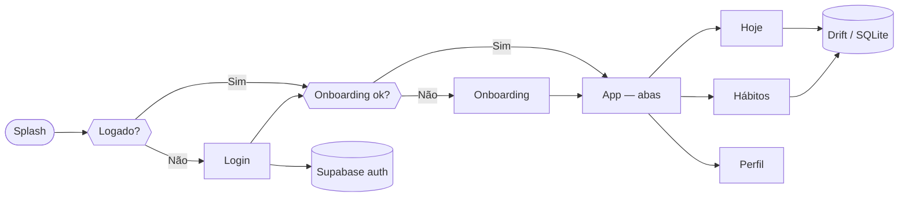

<p align="center">
  
</p>

<p align="center">
  <a href="https://flutter.dev"></a>
  <a href="https://dart.dev"></a>
  <a href="https://riverpod.dev"></a>
  <a href="https://supabase.com"></a>
  <a href="https://drift.simonbinder.eu"></a>
</p>

<br/>

<h2 align="center">📱 Um app pensado pra rotina de verdade</h2>

<p align="center"><strong>Pulse</strong> transforma hábitos em algo <strong>direto</strong>: menos fricção, mais clareza no que você prometeu fazer — e feedback leve quando você fecha o dia.<br/><br/>
<sub>Ótimo para quem só quer um app que abre rápido, mostra <strong>hoje</strong>, e registra conquistas sem esforço.</sub></p>

<p align="center">
  
  &nbsp;&nbsp;
  
</p>

<br/>

<h2 align="center">⭐ O que existe hoje no produto</h2>

<br/>

<table>
  <tr>
    <td width="33%" valign="top" align="center">
      <br/><br/>
      <b>Lista “hoje só o que conta”</b><br/><br/>
      <small>Hábitos filtrados pelos dias da semana.<br/><b>Toque</b> para marcar ou desmarcar.<br/><i>Gestos simples · feedback imediato</i></small>
    </td>
    <td width="34%" valign="top" align="center">
      <br/><br/>
      <b>Do zero ao hábito em segundos</b><br/><br/>
      <small>Nome, categoria, ícone e cor.<br/><b>Meta numérica</b> + <b>unidade</b> livre:<br/><i>km, copos, min, páginas… você escolhe o contexto</i></small>
    </td>
    <td width="33%" valign="top" align="center">
      <br/><br/>
      <b>Consistência em números</b><br/><br/>
      <small>Sequência atual.<br/><b>Histórico</b> de melhor série.<br/>Taxa de conclusão em janela de ~30 dias</small>
    </td>
  </tr>
  <tr><td colspan="3"><br/></td></tr>
  <tr>
    <td valign="top" align="center">
      <br/><br/>
      <b>Vários pings no mesmo dia</b><br/><br/>
      <small><b>Vários horários por hábito</b> no banco<br/>+ opção de <b>gerar distribuição</b> ao longo do dia<br/><i>(pipeline de OS notification = próximo passo natural)</i></small>
    </td>
    <td valign="top" align="center">
      <br/><br/>
      <b>Experiência de primeiro uso completa</b><br/><br/>
      <small>Splash · login · onboarding<br/><b>Google & e-mail</b> quando Supabase está configurado.<br/><i>Roda também sem backend para demos de UI.</i></small>
    </td>
    <td valign="top" align="center">
      <br/><br/>
      <b>Visual atual, sem poluição</b><br/><br/>
      <small>Painéis “glass”.<br/>Tema coeso · animações onde ajudam<br/><i>Fluxo navegável e estados bem definidos.</i></small>
    </td>
  </tr>
</table>

<br/>

<h2 align="center">🗺️ Fluxo do app — visão rápida</h2>



<br/>

<h2 align="center">🧱 Stack — o que entra no PR</h2>

| Camada | Ferramentas |
|:--|:--|
| **App** | Flutter · Material 3 |
| **Estado** | Riverpod |
| **Rotas** | go_router |
| **Persistência** | Drift + SQLite |
| **Auth (opcional)** | Supabase · Google Sign-In |

<p align="center"><sub>Detalhes de versão no <code>pubspec.yaml</code>.</sub></p>

<br/>

<h2 align="center">📂 Onde está cada coisa</h2>

```
lib/
├── core/           tema · router · database (Drift) · utilitários
├── features/       auth · habits (domínio, dados, telas)
├── providers/
└── main.dart
```

<br/>

<h2 align="center">🚀 Clonar e rodar</h2>

```bash
flutter pub get
dart run build_runner build --delete-conflicting-outputs
flutter run
```

<p align="center"><small>Supabase via <code>--dart-define=SUPABASE_URL=...</code> e <code>SUPABASE_ANON_KEY=...</code> · modelos em <code>.vscode/*.example.json</code> · <b>não commite chaves</b>.</small></p>

---

<p align="center">
  <br/>
  
  &emsp;
  <strong>PULSE</strong> — pequenos passos repetidos mudam dias inteiros.
  <br/><br/>
</p>
