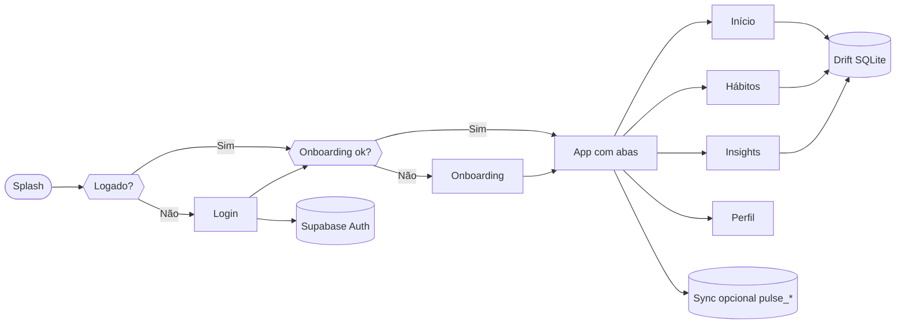

<p align="center">
  
</p>

<p align="center">
  <a href="https://flutter.dev"></a>
  <a href="https://dart.dev"></a>
  <a href="https://riverpod.dev"></a>
  <a href="https://supabase.com"></a>
  <a href="https://drift.simonbinder.eu"></a>
</p>

<p align="center"><strong>Pulse</strong> é um app de hábitos com foco em <strong>hoje</strong>: pouca fricção, clareza no que importa e registo rápido do progresso.</p>

<p align="center">
  <sub>Offline-first com SQLite local; login e nuvem opcionais via Supabase — ideal para uso real no dia a dia e para explorar a UI sem backend.</sub>
</p>

<p align="center">
  
  &nbsp;
  
</p>

<br/>

## Índice

- [Funcionalidades](#funcionalidades)
- [Fluxo no app](#fluxo-no-app)
- [Stack](#stack)
- [Estrutura do projeto](#estrutura-do-projeto)
- [Começar](#começar)
- [Supabase e variáveis de ambiente](#supabase-e-variáveis-de-ambiente)
- [Sincronização e dados na nuvem](#sincronização-e-dados-na-nuvem)
- [Excluir conta (Edge Function)](#excluir-conta-edge-function)
- [Testes e análise estática](#testes-e-análise-estática)

<br/>

## Funcionalidades

<table>
  <tr>
    <td width="33%" valign="top" align="center">
      <br/><br/>
      <b>Visão do dia e hábitos</b><br/><br/>
      <small>Resumo no <strong>Início</strong>, lista “só o que conta” por dia da semana, toque para marcar, métricas de consistência e sequência.</small>
    </td>
    <td width="34%" valign="top" align="center">
      <br/><br/>
      <b>Criar e afinar hábitos</b><br/><br/>
      <small>Nome, categoria, ícone, cor, dias ativos, <strong>meta numérica</strong> com unidade livre e <strong>vários lembretes</strong> por dia (notificações locais).</small>
    </td>
    <td width="33%" valign="top" align="center">
      <br/><br/>
      <b>Insights leves</b><br/><br/>
      <small>Sugestões baseadas em hábitos e (quando existir) histórico recente de humor — sem sobrecarregar o ecrã.</small>
    </td>
  </tr>
  <tr><td colspan="3"><br/></td></tr>
  <tr>
    <td valign="top" align="center">
      <br/><br/>
      <b>Bem-estar rápido</b><br/><br/>
      <small>Check-in de humor e energia, cartão no dashboard, histórico e tendências com gráfico discreto.</small>
    </td>
    <td valign="top" align="center">
      <br/><br/>
      <b>Gamificação opcional</b><br/><br/>
      <small>XP por conclusões, níveis, catálogo de conquistas — tudo persistido localmente no Drift.</small>
    </td>
    <td valign="top" align="center">
      <br/><br/>
      <b>Conta e privacidade</b><br/><br/>
      <small>Login com <strong>e-mail</strong> ou <strong>Google</strong> (Supabase), onboarding, tema escuro, <strong>excluir conta</strong> com confirmação e limpeza local + remota.</small>
    </td>
  </tr>
</table>

<br/>

## Fluxo no app



<br/>

## Stack

| Camada | Tecnologias |
|:--|:--|
| **UI** | Flutter · Material 3 · painéis estilo glass |
| **Estado** | Riverpod |
| **Rotas** | go_router |
| **Persistência local** | Drift · SQLite |
| **Rede / auth (opcional)** | supabase_flutter · Google Sign-In |
| **Notificações** | flutter_local_notifications · timezone |
| **Gráficos** | fl_chart |

Versões concretas de pacotes: ver [`pubspec.yaml`](pubspec.yaml). SDK Dart: `^3.11.3`.

<br/>

## Estrutura do projeto

```
lib/
├── core/
│   ├── config/          # Ambiente (Supabase, flags)
│   ├── database/        # Drift — hábitos, completions, outbox, gamificação, bem-estar
│   ├── notifications/   # Lembretes de hábitos
│   ├── router/          # go_router, shell
│   ├── sync/            # Motor de sync + outbox + watermarks
│   └── theme/           # Tema claro/escuro Pulse
├── features/
│   ├── auth/            # Login, onboarding, exclusão de conta
│   ├── dashboard/       # Início (cartões, hábitos de hoje, humor)
│   ├── gamification/    # XP, níveis, conquistas
│   ├── habits/          # Lista, formulário, checklist de hoje, perfil
│   ├── insights/        # Motor e ecrã de insights
│   ├── settings/        # Preferências (ex.: tema)
│   └── wellbeing/       # Humor, histórico, providers
├── providers/           # Riverpod global (DB, sync, auth, …)
├── pulse_app.dart
└── main.dart
```

Outros:

- [`test/`](test/) — testes unitários e de widget
- [`supabase/functions/delete-account/`](supabase/functions/delete-account/) — Edge Function para apagar dados e utilizador
- [`.vscode/flutter-dart-define.example.json`](.vscode/flutter-dart-define.example.json) — modelo de `dart-define` para Supabase

<br/>

## Começar

**Pré-requisitos:** [Flutter](https://docs.flutter.dev/get-started/install) (canal stable, compatível com Dart 3.11+), ferramentas da plataforma alvo (Xcode / Android SDK).

```bash
git clone <url-do-repositório> pulse
cd pulse
flutter pub get
dart run build_runner build --delete-conflicting-outputs
flutter run
```

O `build_runner` gera código Drift (`*.g.dart`). Volte a executá-lo após alterar o esquema das tabelas em `app_database.dart`.

<br/>

## Supabase e variáveis de ambiente

O app funciona **sem** Supabase (fluxo de login mostra o estado “sem backend”). Para auth e sync na nuvem, defina no arranque:

| Variável | Uso |
|:--|:--|
| `SUPABASE_URL` | URL do projeto (ex.: `https://xxx.supabase.co`) |
| `SUPABASE_ANON_KEY` | Chave **anon** ou **publishable** do projeto — a que o cliente pode expor |

**Nunca** coloque a chave `service_role` / `sb_secret_` no app Flutter: o runtime rejeita essa configuração por segurança.

**Exemplo de defines** (ajuste e use no VS Code / Android Studio ou na linha de comando):

```bash
flutter run \
  --dart-define=SUPABASE_URL=https://SEU_PROJETO.supabase.co \
  --dart-define=SUPABASE_ANON_KEY=sua_chave_anon_ou_publishable
```

Modelo JSON para copiar chaves: [`.vscode/flutter-dart-define.example.json`](.vscode/flutter-dart-define.example.json). Para depuração no VS Code, alinhe com [`.vscode/launch.example.json`](.vscode/launch.example.json).

**Google Sign-In:** além das variáveis acima, configure o OAuth do Google no projeto Supabase e os `CFBundleURLSchemes` / `Android` client IDs conforme a documentação do Supabase e do plugin `google_sign_in`.

<br/>

## Sincronização e dados na nuvem

Com Supabase ativo, o motor em [`lib/core/sync/pulse_sync_engine.dart`](lib/core/sync/pulse_sync_engine.dart):

- envia alterações pendentes a partir de uma **fila local** (`SyncOutbox`);
- faz **pull incremental** usando marcas de tempo guardadas em `SharedPreferences` (`SyncWatermarkStore`).

Tabelas remotas esperadas (esquema alinhado com o cliente):

- `pulse_habits`
- `pulse_habit_completions`
- `pulse_wellbeing_logs`

Gamificação e parte da lógica de insights permanecem **só no dispositivo**, salvo evoluções futuras do produto.

<br/>

## Excluir conta (Edge Function)

No **Perfil**, a ação **Excluir conta** (com confirmação escrita `EXCLUIR`):

1. Chama a Edge Function **`delete-account`** no Supabase com o JWT da sessão.
2. Após sucesso, limpa dados locais (Drift, outbox, watermarks, onboarding), cancela notificações agendadas e faz **sign out**.

A função no repositório: [`supabase/functions/delete-account/index.ts`](supabase/functions/delete-account/index.ts). Ela valida o token, remove linhas do utilizador em `pulse_wellbeing_logs`, `pulse_habit_completions` e `pulse_habits`, e chama a API de administração para remover o utilizador em **auth**. Isso requer a **service role** disponível no ambiente da função (segredo `SUPABASE_SERVICE_ROLE_KEY` no dashboard do Supabase / CLI).

**Deploy** ([Supabase CLI](https://supabase.com/docs/guides/cli)):

```bash
supabase functions deploy delete-account
```

Garanta que os segredos da função incluem a URL do projeto e a service role conforme a documentação atual do Supabase para Edge Functions.

<br/>

## Testes e análise estática

```bash
flutter analyze
flutter test
```

<br/>

---

<p align="center">
  <br/>
  
  &emsp;
  <strong>PULSE</strong> — pequenos passos repetidos mudam dias inteiros.
  <br/><br/>
</p>
